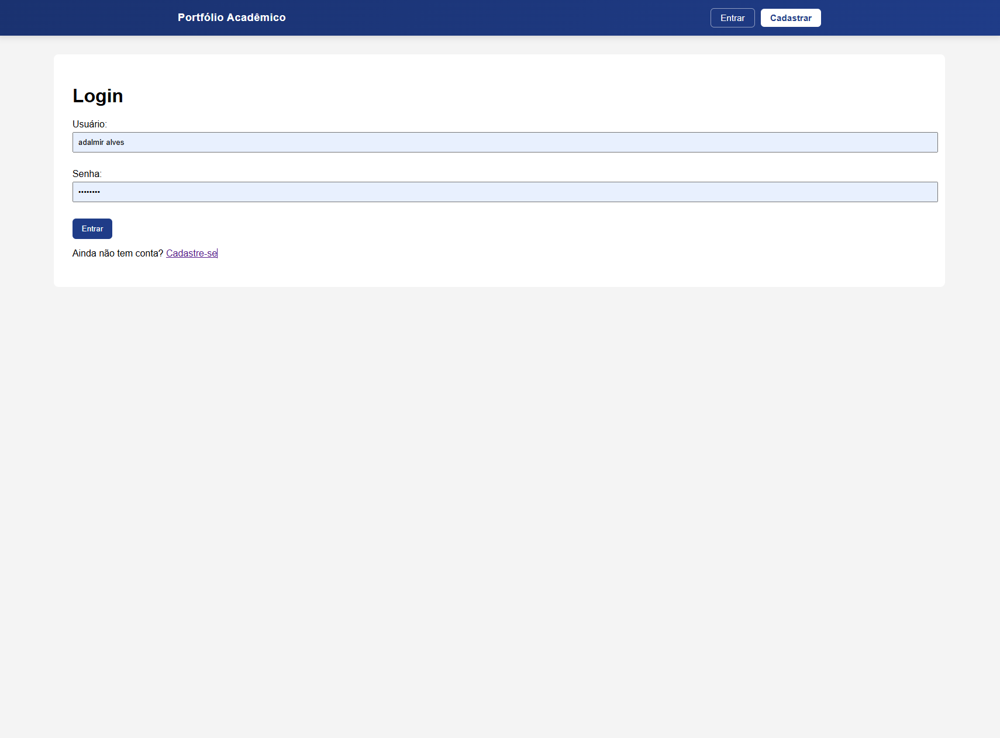
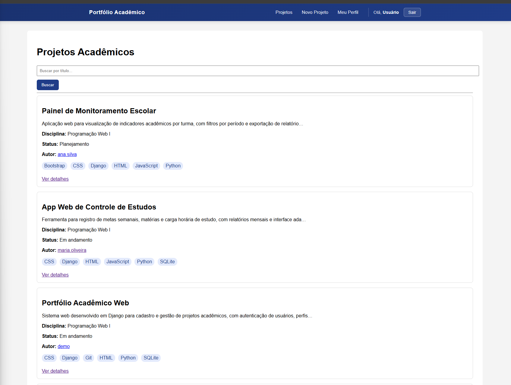

# Portfólio Acadêmico

Aplicação web desenvolvida com Django para o contexto **Portfólio Acadêmico**: cadastro e gestão de projetos de alunos, com descrição, tecnologias utilizadas, integrantes e status de desenvolvimento.

**Disciplina:** Programação Web I — IFSE Campus Lagarto  
**Professor:** Jean Louis

## Integrantes do grupo

- Marcos Henrique Garcia Pereira
- Márcio Pierre Santos Monteiro

## Tecnologias utilizadas

- Python 3
- Django 6
- HTML / CSS
- SQLite

## Estrutura do projeto

- `accounts` — autenticação, perfil e cadastro de usuários
- `portfolio` — entidade principal `Projeto`, CRUD, busca e relacionamentos
- `core` — configurações e URLs raiz
- `templates/base.html` — layout e navegação compartilhados

## Como executar o projeto

### 1. Clonar e entrar na pasta

```bash
cd portfolio-academico-django
```

### 2. Ambiente virtual e dependências

```bash
python -m venv venv
venv\Scripts\activate
pip install -r requirements.txt
```

### 3. Banco de dados e dados de exemplo

As migrações já estão versionadas no repositório. **Execute nesta ordem** (obrigatório):

```bash
python manage.py migrate
python manage.py loaddata dados_exemplo
```

**Usuários de demonstração (após `loaddata`):**

Todos usam a mesma senha: **`demo123`**

| Usuário          | Nome              | E-mail                    |
|------------------|-------------------|---------------------------|
| `demo`           | Usuário Demonstração | demo@example.com       |
| `ana.silva`      | Ana Silva         | ana.silva@example.com     |
| `joao.santos`    | João Santos       | joao.santos@example.com   |
| `maria.oliveira` | Maria Oliveira    | maria.oliveira@example.com |

A fixture inclui 4 perfis completos, 10 tecnologias e 8 projetos com todos os campos preenchidos.

### 4. Iniciar o servidor

```bash
python manage.py runserver
```

Acesse: http://127.0.0.1:8000/

- Não autenticado → redireciona para login
- Após login → listagem de projetos em `/portfolio/`

### Variáveis de ambiente (segurança — Trabalho 2)

Opcional em desenvolvimento local (valores padrão já permitem `localhost`). Em produção, defina:

| Variável | Padrão (dev) | Descrição |
|----------|--------------|-----------|
| `DJANGO_SECRET_KEY` | chave insegura de fallback | Chave secreta do Django |
| `DJANGO_DEBUG` | `True` | `False` em produção |
| `DJANGO_ALLOWED_HOSTS` | `localhost,127.0.0.1` | Hosts permitidos (separados por vírgula) |

Exemplo (PowerShell):

```powershell
$env:DJANGO_SECRET_KEY="sua-chave-secreta-longa"
$env:DJANGO_DEBUG="False"
$env:DJANGO_ALLOWED_HOSTS="seusite.com,www.seusite.com"
```

Relatório de auditoria do Trabalho 2: [`RELATORIO_SEGURANCA.md`](RELATORIO_SEGURANCA.md).

## Requisitos funcionais implementados

| RF | Descrição | Implementação |
|----|-----------|---------------|
| RF01 | Autenticação (nome, e-mail, senha, login/logout Django) | `RegistroForm`, `LoginView`, `LogoutView` em `accounts/` |
| RF02 | Perfil com edição | `perfil_view`, `editar_perfil_view`, model `Profile` |
| RF03 | Modelo central (≥5 campos) | Model `Projeto` em `portfolio/models.py` |
| RF04 | CRUD completo (autenticado) | Views em `portfolio/views.py` + templates |
| RF05 | Relacionamento FK/M2M na interface | `autor` → User; `tecnologias` → Tecnologia (badges) |
| RF06 | Forms com validação personalizada | `clean_*` em `ProjetoForm` e `RegistroForm` |
| RF07 | Busca/filtro GET na listagem | Parâmetro `busca` em `lista_projetos_view` |
| RF08 | `@login_required` e edição/exclusão só pelo autor (IDOR → 404) | `get_object_or_404(..., autor=request.user)` |
| RF09 | `base.html`, navegação, Django Messages | `templates/base.html` + `messages` nas views |
| RF10 | Migrations e dados de exemplo | `migrations/` + `loaddata dados_exemplo` |

## Capturas de tela

**Login** (`/accounts/login/`)



**Listagem de projetos** (`/portfolio/`)



## Testes

O projeto possui **53 testes automatizados** em `accounts/tests/`, `portfolio/tests/` e `core/tests/`.

### Executar todos os testes (modo resumido)

```bash
python manage.py test
```

### Executar mostrando o nome de cada teste (recomendado para avaliação)

Use `-v 2` para imprimir cada teste na tela enquanto roda:

```bash
python manage.py test -v 2
```

Exemplo de saída:

```
test_registro_post_valido (accounts.tests.test_views.AccountsViewsTests) ... ok
test_lista_get_200 (portfolio.tests.test_views.PortfolioViewsTests) ... ok
...
Ran 53 tests in Xs
OK
```

### Testar um módulo específico

```bash
python manage.py test accounts -v 2
python manage.py test portfolio -v 2
python manage.py test core -v 2
```

### Verificar cobertura de código (meta mínima: **85%**)

```bash
python -m coverage run manage.py test -v 2
python -m coverage report
```

O relatório exibe a porcentagem de linhas cobertas por arquivo (`views.py`, `forms.py`, `models.py`, etc.).

Os testes cobrem models, forms e views dos apps `accounts`, `portfolio` e `core`.

## Observações

- O cadastro solicita **nome de usuário** além de nome, e-mail e senha (padrão do modelo `User` do Django).
- Novos cadastros exigem senha com **no mínimo 10 caracteres** (RS03).
- O arquivo `db.sqlite3` não deve ser versionado (está no `.gitignore`); use `migrate` + `loaddata` em cada máquina.
- Logs de exclusão ficam em `logs/seguranca.log` (o arquivo de log não é versionado).
- Para gerar `requirements.txt` atualizado: `pip freeze > requirements.txt`
